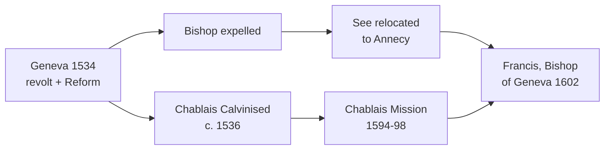

# 01 — Historical and Ecclesial Context

> [!abstract] Thesis of this note
> Salesian gentleness is not a temperament. It is a **deliberate pastoral strategy chosen inside a century of religious violence** — and it only becomes intelligible against that background.

---

## 1. The Duchy of Savoy — a frontier

Born 1567 into the nobility of **Savoy**: a mountainous duchy wedged between France, the Swiss cantons and Italy, ruled by the Duke of Savoy from Turin. Politically it is a buffer state, permanently squeezed between French ambition and Swiss expansion.

Consequence for his formation: he is a **borderland man**. Catholic and Protestant Europe do not meet in his life as an abstraction; they meet across a lake.

## 2. Geneva, 1534 — the lost see

- 1534: Geneva **revolts against the Duke of Savoy**, declares independence, embraces the Reformation.
- Geneva becomes the fortress of **Calvinism**, giving refuge to Calvin himself when exiled from France.
- From Geneva the Reform spreads outwards and takes neighbouring territories — including the **Chablais**, south of the lake.
- The Catholic **Bishop of Geneva is expelled** and relocates to **Annecy**, twenty-two miles south, inside Savoy.

> [!important] The permanent irony
> Francis de Sales is **Bishop of Geneva who never governs Geneva**. He is a bishop in exile from his own cathedral city for his entire episcopate. His diocese is a wound.

## 3. The Wars of Religion

His student years in Paris (c.1580–88) fall inside the **French Wars of Religion**: the Catholic League against Henry of Navarre, sieges, assassinations, and the living memory of the **St Bartholomew's Day massacre**. Civil disorder is normal weather.

> [!tip] Reading key
> When he later writes *"more flies are caught with a spoonful of honey than with a hundred barrels of vinegar,"* he is speaking as a man who watched vinegar being poured for thirty years and counted the corpses.

## 4. The Council of Trent (1545–1563) — his working programme

Trent reaffirmed Catholic doctrine (sacraments, Eucharist, justification) and mandated **reform of clergy formation and monastic discipline**. Francis is born four years after it closes. He belongs to the **generation charged with implementing it** — not debating it.

His episcopate is therefore Tridentine reform in a concrete diocese: catechesis, examined clergy, synods, parish visitation, seminary, reform of religious houses → see [[04 Bishop of Annecy - Pastoral Reform]].

## 5. The state of the clergy

He inherits a clergy marked by **ignorance, relaxed discipline, and no theological training**. His own diagnosis of why the Chablais was lost is blunt: the Calvinist ministers exploited the ignorance of Catholic priests.

> [!quote] To his clergy
> *"Ignorance of priests is more greatly to be feared than sin."*

---

## Comparative frame — three ways to answer the Reformation

| Response | Method | Salesian judgement |
|---|---|---|
| **Coercion** (Wars of Religion, League) | Force of arms, the state | Rejected outright — *"to force the mind to believe is to force it from all belief"* |
| **Polemic** (standard controversial preaching) | Invective, disputation as fencing | Rejected as counter-productive — *"when we bring the lamp too close to their eyes, they start back from the light"* |
| **Persuasion in charity** (Salesian) | Clear doctrine + printed word + personal affection | Adopted; measurable result in the Chablais |

---

## Recall

- Q:: In what year did Geneva revolt from Savoy and adopt the Reformation? A:: 1534
- Q:: Where did the exiled Bishops of Geneva reside? A:: Annecy, in Savoy, 22 miles south of Geneva
- Q:: Which Council's reform programme does Francis de Sales implement as bishop? A:: The Council of Trent (1545–63)
- Q:: What did Francis say was more to be feared than sin, in priests? A:: Ignorance

Prev → [[St Francis de Sales - Course Home]] | Next → [[02 Life and Biography - Chronology]]
