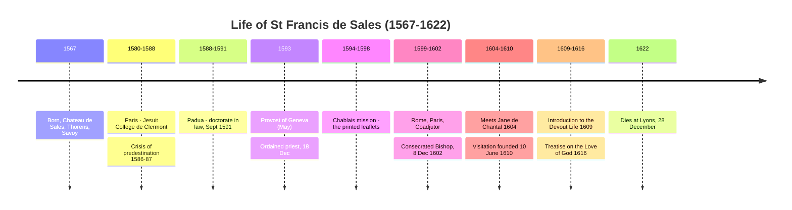

# 02 — Life and Biography: Chronology

> [!abstract] Reading rule
> Read the life **as the first draft of the doctrine**. Every major teaching has a biographical wound or joy behind it: the predestination crisis → the primacy of love over fear; the choleric temper conquered → gentleness; the Chablais → truth spoken in charity; Chantal → spiritual friendship.

---

## Six movements

---

## 1. Origins and family (1567)

Born **21 August 1567** in the *chambre de St François d'Assise* at the **Château de Sales**, parish of **Thorens**, Savoy. Eldest child of **François, Seigneur de Nouvelles**, and the heiress of the lands of **Boisy**; on marriage the father took her estate's title, so the parents are known as **Monsieur and Madame de Boisy**.

The father is the constant dramatic foil of the early life: a man of legitimate worldly ambition for a gifted eldest son.

## 2. Paris (c.1580–1588) — the crisis

After schooling at La Roche and Annecy, sent to Paris for rhetoric, humanities, philosophy. His father wanted the **College of Navarre** (the noble's college); Francis insisted on the **College of Clermont**, run by the **Jesuits**, where he also read theology and Greek.

> [!warning] The crisis of predestination (1586–87)
> Francis became convinced he was **predestined to damnation**. The anguish was total and physically wrecked him — he could not eat or sleep.
> The resolution: kneeling before the **Black Madonna at Saint-Étienne-des-Grès**, he prayed the ***Memorare***. The torment vanished instantly. He then made a **vow of chastity** and promised the daily Rosary.

**Why this matters theologically.** He does not solve the problem by out-arguing Calvin about predestination. He solves it by an act of **love and self-surrender to a God who is good**. The whole later system — God as love before God as judge, *"it is better to fear God from love than to love Him from fear"* — is the mature doctrinal form of what happened in that chapel at nineteen.

## 3. Padua (1588–1591) — the doctorate

Civil and Roman law under **Guy Panciroli**; spiritual direction from the Jesuit **Père Possevin**. **September 1591**: doctorate in jurisprudence. Panciroli personally conferred cap and ring, saying the University had found in Francis *"the sublimest qualities of head and heart."*

He returns home a trained **jurist** — visible ever after in the ordered architecture of his books and the forensic clarity of his controversy.

## 4. The vocational crisis and ordination (1591–1593)

Monsieur de Boisy had arranged two things: a **marriage** to the heiress **Mdlle de Suchet**, daughter of the Seigneur de Végy, and a seat as **Senator at the Court of Savoy**. Francis refused both.

The impasse broke through his cousin **Canon Louis de Sales**, who secured him the **Provostship of the Chapter of Geneva** — the dignity second only to the bishop. Faced with an honour, the father relented: *"Go then and serve God only."*

- **May 1593** — installed as Provost
- **18 December 1593** — ordained priest

## 5. The Chablais mission (1594–1598)

Volunteered, autumn 1594, for the mission to the **Chablais**, Calvinist for sixty years. Set out **9 September** with his cousin Louis; based at the fortress of **Allinges**.

Conditions and anecdotes:
- assassination attempts;
- a night tied to a tree branch to escape wolves;
- crawling across an **icy plank over the River Drance** to say daily Mass.

The Calvinists were forbidden to hear him and shut their doors. So he **wrote**: hand-copied tracts placarded in streets and squares and slipped under doors. Result by 1598: almost the whole population of some **72,000** returned to Catholic faith. The tracts became *The Catholic Controversy* → [[03 The Chablais Mission and The Catholic Controversy]].

## 6. Rome, Paris, and the episcopate (1599–1602)

- **1599** — to **Rome** to petition **Clement VIII**. The Pope examined him theologically in full Consistory, was delighted, and named him **Coadjutor Bishop of Geneva**.
- **1602** — to **Paris**, to negotiate the religious status of the **Gex** province with **Henry IV**. Preached the court Lent; the King called him *"the phoenix of prelates"* and repeatedly offered him a richer French see.

> [!quote] His refusal
> *"I have married a poor wife, and I cannot desert her for a rich one."*

- **September 1602** — Bishop **Claude de Granier** dies.
- **8 December 1602** — **consecrated Bishop of Geneva** in the village church at **Thorens**; residence at **Annecy**.

## 7. Chantal and the Visitation (1604–1610)

Preaching the Lent at **Dijon, 1604**, he noticed a widow in deep mourning listening intently — and recognised her from an earlier vision: **Jane Frances de Chantal**. He became her director; the friendship becomes a theological locus → [[08 Spiritual Direction, Friendship and the Visitation]].

**10 June 1610** — foundation of the **Order of the Visitation of Holy Mary**, originally allowing members to visit the sick and destitute, later placed under strict enclosure.

## 8. The books (1609, 1616)

- **1609 — *Introduction to the Devout Life***. Origin: personal notes and letters written for **Madame de Charmoisy**, a noblewoman balancing court duties with a desire for holiness. The Jesuit **Père Forrier** saw the notes and pressed for publication; Francis laughed that people wanted him to believe he *"had written a book without meaning it."* Instant European success, read by commoners and kings → [[05 Introduction to the Devout Life]]
- **1616 — *Treatise on the Love of God***. He said he wrote it *"as much on my heart as on the paper."* His brother once found him in radiant ecstasy while composing it → [[06 Treatise on the Love of God]]

## 9. Death (1622)

Late 1622: already failing, he accompanies the Savoy court to Avignon and then to **Lyons** to meet the French king. Offered splendid mansions, he asked instead for the **gardener's draughty, smoky room** at the Visitation monastery.

After his last Christmas midnight Mass he suffered **apoplexy**. He bore the treatments — including **red-hot irons applied to the head** — with characteristic patience, and died on **28 December 1622**, aged 55, the name of **Jesus** his last word.

## 10. Posthumous

| Event | Year | By |
|---|---|---|
| Beatified | 1661 | — |
| Canonised | 1665 | Alexander VII |
| **Doctor of the Church** | 1877 | Pius IX |
| Patron of writers and journalists | 1923 | Pius XI |

---

## Recall

- Q:: Date and place of birth? A:: 21 August 1567, Château de Sales, Thorens, Savoy
- Q:: What crisis struck him in Paris 1586–87, and how was it resolved? A:: Conviction of his own damnation/reprobation; resolved praying the *Memorare* before the Black Madonna at Saint-Étienne-des-Grès
- Q:: Two things his father arranged that he refused? A:: Marriage to Mlle de Suchet; a seat in the Senate of Savoy
- Q:: Ordination date? A:: 18 December 1593
- Q:: Why did he begin printing leaflets in the Chablais? A:: The Calvinists were forbidden to hear him preach and shut their doors
- Q:: Date of episcopal consecration and where? A:: 8 December 1602, at Thorens
- Q:: Whom did he meet at Dijon in 1604? A:: St Jane Frances de Chantal
- Q:: Foundation date of the Visitation? A:: 10 June 1610
- Q:: What did Henry IV call him? A:: "The phoenix of prelates"
- Q:: Date of death and last word? A:: 28 December 1622, at Lyons; "Jesus"

Prev → [[01 Historical and Ecclesial Context]] | Next → [[02a Portrait, Family and Death]]
