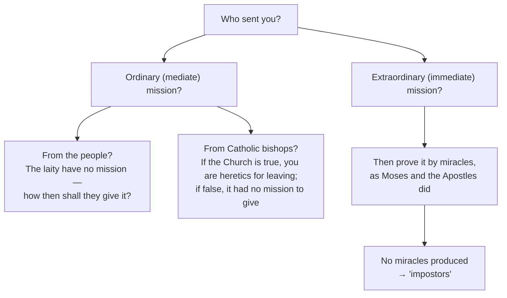

# 03 — The Chablais Mission and *The Catholic Controversy*

> [!abstract] Thesis
> The Chablais is where Salesian spirituality is **field-tested before it is written**. The same man who argues with forensic severity about the rule of faith calls his opponents "dear brothers" — and it is precisely that combination that works.

---

## 1. The situation (1594)

Chablais: south shore of Lake Geneva, Calvinist for sixty years. Francis arrives to closed doors, jeers, threats, and a ministerial ban on attending his sermons.

## 2. The innovation: the printed word

He judged that *"words in the mouth are living, on paper dead"* — and used paper anyway, resolving *"to refute their errors by means of flying tracts written between one sermon and another."* Hand-copied, **placarded in streets and squares**, slipped **under doors**.

> [!tip] Why this is his title to the patronage of journalists
> He bypassed a media blockade by **taking the message into the home** when the public square was closed. The tracts were later collected as *The Catholic Controversy*.

**Result by 1598:** the great bulk of some 72,000 inhabitants reconciled.

---

## 3. The argument: "Who sent you?"

The structural core of his apologetic is the **question of mission**. To be a pastor of souls is to be an **ambassador of Jesus Christ** — an ambassador must be *sent*.

> [!quote] Rom 10:15 as the hinge
> *"How shall they preach, says the Apostle, unless they be sent?"*

Conclusion pressed on the people: *"You have no justification for having quitted that ancient Church… on the faith of preachers who had no legitimate mission."*

## 4. The rule of faith

He lists **eight rules** — Scripture, tradition, the Church, Councils, the Fathers, the Pope, miracles, natural reason — and then subordinates them all to one formula:

> [!quote] The master principle
> *"The sole and true rule of right-believing is the Word of God preached by the Church of God."*

| Protestant claim | Salesian counter |
|---|---|
| *Sola scriptura* | You yourselves amputated books — Maccabees, Ecclesiasticus (prayer for the dead, free will), James. Who authorised the surgery? |
| Private judgement by the "interior persuasion of the Holy Spirit" | This makes every believer the supreme judge of revelation — a subjective illusion |
| Scripture needs no interpreter | *"If then the Church can err, O Calvin, O Luther, to whom shall I have recourse in my difficulties?"* Scripture is a text; a text requires an infallible interpreter |
| Tradition is human accretion | *"Hold fast the Traditions which you have received, whether by word or by our epistle"* (2 Thess 2:14) |
| The Reform is one work of the Spirit | Lutherans, Zwinglians and Calvinists cannot agree on the sacraments; the mark of the true Church is **unity under one visible head** |

He also presses the argument from **natural reason**: the absurdity of a God who commands an impossible law and then damns for failing it, or who is made the **author of sin**.

## 5. The tone: charity as method, not decoration

He addresses Calvinists as **"dear brothers"** and **"beloved fellow-countrymen."** Catholic zealots objected to calling heretics "brethren"; he ignored them, holding that *"turbulent zeal, zeal that is neither moderate nor wise, pulls down in place of building up."*

**1597 — the disputation with Theodore Beza** in Geneva. Beza was Calvin's successor and "oracle of Calvinism." Commissioned by Clement VIII to attempt his conversion, Francis engaged him with complete courtesy. Beza did not convert, but was visibly moved; they debated *"in public that all might see how Christian gentlemen may differ in principle but not in affection."*

> [!important] The three governing maxims of Salesian evangelisation
> 1. *"Truth which is not charitable proceeds from a charity which is not true."*
> 2. *"To force the mind to believe is to force it from all belief."*
> 3. *"Love and affection have a greater empire over souls than harshness and severity."*

He therefore discouraged **controversial sermons** as a fencing match: *"when we bring the lamp too close to their eyes, they start back from the light."* Preferred method: state Catholic truth simply and clearly, and let the Holy Spirit work.

---

## 6. Theological evaluation

> [!note] What is actually new here
> Not the content — the arguments on mission, rule of faith and unity are standard post-Tridentine. What is new is the **anthropology of persuasion**: he assumes the hearer is *free*, that assent cannot be coerced, and that affection is the precondition of intellectual conviction. That is already the *Treatise*'s doctrine of grace, which "entices the heart" without overpowering liberty → [[06 Treatise on the Love of God]].

Note the tension worth flagging in an essay: he calls them "brothers" **and** calls the ministers "impostors". His charity is toward **persons**; his severity is toward **claims**. That distinction — never blurred in either direction — is the whole Salesian method of controversy.

---

## Recall

- Q:: What device did he use when the Calvinists refused to hear him preach? A:: Hand-written/printed tracts placarded and slipped under doors — later *The Catholic Controversy*
- Q:: State his one-sentence rule of faith. A:: "The sole and true rule of right-believing is the Word of God preached by the Church of God"
- Q:: What is the "Who sent you?" argument? A:: Preachers must have a legitimate mission — mediate (which the reformers cannot derive from laity or from Catholic bishops) or immediate (which requires proof by miracles)
- Q:: Whom did he debate in Geneva in 1597? A:: Theodore Beza, Calvin's successor
- Q:: Quote his maxim linking truth and charity. A:: "Truth which is not charitable proceeds from a charity which is not true"

Prev → [[02a Portrait, Family and Death]] | Next → [[04 Bishop of Annecy - Pastoral Reform]]
