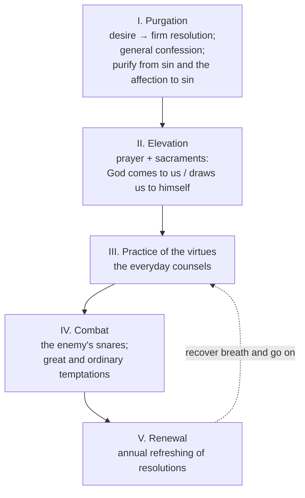

# 05 — *Introduction to the Devout Life* (1609)

> [!abstract] Thesis
> A spiritual manual whose revolutionary claim is contained in its *addressee*: not a monk, not a nun, but **Philothea** — anyone at all who loves God — living exactly where she already is.

---

## 1. Philothea

**Philothea = "a lover of God."** Originally Madame de Charmoisy; universalised by the name. He addresses *"a soul who, by the desire of devotion, aspires to the love of God."* The rhetorical device *is* the thesis: the book has no vocational entry requirement.

## 2. What devotion is — and is not

> [!quote] The definition
> True devotion *"is no other thing than a true love of God."* When charity reaches the perfection at which we *"not only do good, but do so carefully, frequently and readily, then it is called devotion."*
> It is *"a spiritual nimbleness and vivacity, by means of which charity works in us."*

**Structure of the definition:** charity is the substance; devotion is charity's **speed, ease and joy**. Devotion is not a separate virtue added to love — it is love in good running order.

| False devotion | Its symptom |
|---|---|
| The faster with a heart *"full of rancour"* | Ascesis without charity |
| The constant prayer using *"angry, proud, and injurious language"* | Prayer without conversion |
| The almsgiver who will not forgive an enemy | Charity to strangers, none to neighbours |
| (General) colouring devotion *"according to their own fancies"* | Devotion redefined to fit the sins one intends to keep |

## 3. Devotion adapted to every state of life

> [!quote] The creation analogy
> *"In the creation God commanded the plants to bring forth their fruit, each after its kind: even so he commands Christians, who are the living plants of his Church, to bring forth fruits of devotion, each one according to his kind and vocation."*

Devotion *"never spoils anything, but rather perfects all things"* — like a bee that *"sucks its honey from the flowers without injuring them."* Suited to gentleman, artisan, servant, married woman.

The polemical form of the same claim (from the *Treatise*, but the same doctrine):

> [!important] The famous "heresy" text
> *"It is an error, nay rather a heresy, to wish to banish the devout life from the army, from the workshop, from the courts of princes, from the households of married folk."*

## 4. The architecture — five parts

**Part I** supplies the **ten meditations**: Creation; the End for which we are created; the Benefits of God; Sin; Death; Judgement; Hell; Paradise; the election and choice of Paradise; the choice of the devout life.

## 5. The method of prayer

| Stage | What happens |
|---|---|
| **Preparation** | Place yourself in God's presence; invoke his help; **composition of place** — represent the mystery to the imagination as though it were happening now |
| **Considerations** | The work of the understanding on divine things *"not to learn, but to make ourselves love them"* |
| **Affections and resolutions** | The will is stirred (love, zeal, compassion) — but affections must be converted into *"special and particular resolutions for your correction and amendment"*, never left as general feeling |
| **Conclusion: the spiritual nosegay** | Gather the one or two points of greatest relish, like flowers from a garden, and *"inhale its perfume throughout the day"* |

> [!tip] The Salesian test of a meditation
> Did it produce a **particular** resolution? "I will be more patient" fails. "I will not answer sharply when X interrupts me at recreation" passes.

## 6. Direction of intention

The device that makes ordinary life prayable:

> [!quote]
> *"Do all things, then, in the name of God, and all things will be well done. Whether you eat or drink, or recreate yourself… you will profit much in the sight of God, doing all these things because God wishes you to do them."*

*"We turn little actions into great ones when we perform them with a supreme desire to please God."*

## 7. The little virtues

Not the dazzling virtues at the summit of the Cross, but those which, *"like wild thyme, grow at the foot of that Tree of Life"* — and *"give out the sweetest perfume."*

| Virtue | Salesian formulation |
|---|---|
| **Humility** | *"To receive the grace of God into our hearts, they must be void of our own glory."* Its highest point: not merely to acknowledge but **to love your own abjection** |
| **Gentleness** | *"Humility perfects us in regard to God, and gentleness in regard to our neighbour."* Repel anger at once — given an opening it *"makes itself mistress of the place"* |
| **Patience** | Not only with the affliction but with *"the accessories and accidental inconveniences which are attached to them"* |
| **Poverty of spirit** | *"He is poor in spirit that has no riches in his spirit, nor his spirit in his riches"* — compatible with actual wealth |
| **Friendship** | *"Have no friendship save with those who can communicate with you in virtuous things"* → [[08 Spiritual Direction, Friendship and the Visitation]] |
| **Holy simplicity** | Words corresponding to affections; *"simplicity and candour of heart"*, against duplicity and artifice |

## 8. Life in society: conversation, amusements, dress

- **Conversation.** Speak of God often — but *"always speak of God as of God… with the spirit of sweetness, charity and humility"*, not playing the preacher. Rigorous condemnation of **detraction, rash judgement, slander**.
- **Amusements.** Games of pure chance (dice, cards) forbidden — they depend on luck, not industry or skill. Dancing and balls compared to mushrooms: *"the best are of no value."* *"Dance but seldom, Philothea, and only a little, for if you act otherwise you will run a risk of setting your affection upon it."*
- **Dress.** Neat, and appropriate to one's station; but *"be on your guard against affectation, vanity, singularity and levity. Always keep as much as possible on the side of simplicity and modesty."*

> [!note] Note the logic, not just the rules
> He does not forbid the ball; he forbids **setting your affection on it**. The regulation is always a means of keeping the heart free. This is the ascetical form of *holy indifference* → [[06 Treatise on the Love of God]].

## 9. Aridity and desolation

The "fine weather" of consolation does not last; the heart becomes *"a desert, fruitless, barren land."*

Procedure:
1. **Examine** whether the dryness is your own doing — vain complacency, spiritual sloth, duplicity. If so, repent.
2. If no fault appears: **humble yourself, invoke God's joy, and above all "not lose courage."**
3. Understand that dry service is **worth more**:

> [!quote] The roses
> *"Our actions are like roses, which, though they have more external grace when they are fresh, yet give forth a sweeter and stronger scent when they are dry… when they are done in a state of dryness and barrenness, they have a sweeter scent and greater value before God."*

---

## Recall

- Q:: What does "Philothea" mean, and who was the original? A:: "Lover of God"; Madame de Charmoisy
- Q:: Give the Salesian definition of devotion. A:: Charity in the perfection at which we do good "carefully, frequently and readily" — "a spiritual nimbleness and vivacity by means of which charity works in us"
- Q:: Name the five parts of the *Introduction*. A:: Purgation; prayer and sacraments; practice of the virtues; temptations; renewal of resolutions
- Q:: Four stages of Salesian meditation? A:: Preparation (incl. composition of place); considerations; affections and resolutions; spiritual nosegay
- Q:: What is the "spiritual nosegay"? A:: The one or two points of greatest relish gathered at the end of prayer, to be recalled through the day
- Q:: What is "direction of intention"? A:: Doing every ordinary action explicitly because God wills it, which makes little actions great
- Q:: Highest point of humility? A:: Not merely to acknowledge but to love one's own abjection
- Q:: Why are dry actions more meritorious? A:: The image of the rose — dried roses give the stronger scent

Prev → [[04 Bishop of Annecy - Pastoral Reform]] | Next → [[05a Sacramental and Devotional Life]]
