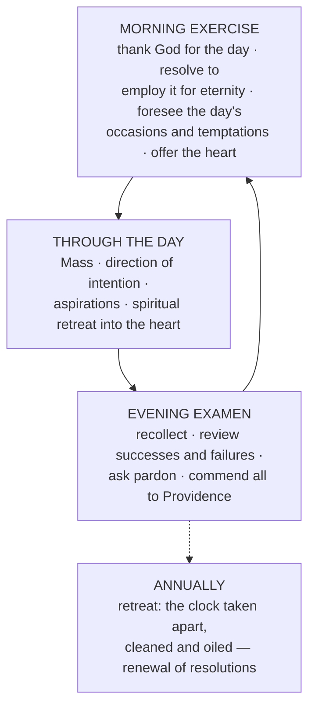

# 05a — Sacramental and Devotional Life

> [!abstract] Thesis
> Salesian interiority is **not free-floating**. The whole edifice of gentleness and indifference rests on a hard sacramental floor: daily Mass, weekly confession, frequent communion, and a fixed daily rhythm of exercises.

---

## 1. The Eucharist — "the sun of spiritual exercises"

The Mass is *"the sun of spiritual exercises"*, the **heart of devotion**, the **soul of piety**.

- Assist at Mass **daily**, offering the Sacrifice with the priest.
- If physically impossible, assist by **spiritual presence**, uniting your intention with the faithful.

**Frequent communion.** Those who communicate often strengthen the soul so effectively that *"it is almost impossible for him to be poisoned by any kind of evil affection."*

| Situation | His counsel |
|---|---|
| Soul free from affection to sin | **Every Sunday** |
| Most evil inclinations conquered, under a director | Up to **daily** |
| Many worldly affairs, resistant family | Never longer than **a month** between communions |

**Preparation and thanksgiving.** Begin the **evening before** with aspirations of love; retire early, rise early. In communion, act faith, hope and charity. Afterwards, give a warm welcome to *"the King of salvation"* and **treat with him the affairs of your soul**.

**Spiritual communion.** When sacramental reception is impossible, unite yourself by ardent desire to *"the life-giving flesh of the Saviour."*

## 2. Confession and the examen

- Confess **humbly and devoutly once a week**, and always before communion.
- Beginners: make a **general confession** — to cleanse the conscience, to know oneself truly, and to receive tailored direction.
- **Against vague accusation.** Not *"I have not loved God enough"* but the **facts, duration and motives** of the sin. Vagueness is the enemy of amendment.
- **Evening examen** daily: thank God for the day; examine behaviour and occupations; ask pardon; commend soul, family and Church to Providence. *"Close the soul's windows against the darkness."*

## 3. Office and vocal prayer

- Attend **public prayer** — Office, Vespers: public devotion carries greater merit and consolation than private.
- Vocal prayer: *Pater*, *Ave*, Creed — in Latin if you wish, **provided you understand it enough to relish the words**.
- **Rule of precedence:** if vocal prayer draws you into mental prayer, **do not resist**. Mental prayer is more pleasing to God.

## 4. Marian devotion

- Born in **August, within the Octave of the Assumption**.
- The **Memorare** at Saint-Étienne-des-Grès delivered him from the despair of reprobation — and he **taught the prayer to his penitents** ever after → [[02 Life and Biography - Chronology]].
- Vowed the **daily Rosary** on the same occasion.
- Renewed his **consecration to Jesus and Mary at the Holy House of Loreto**.
- **Why "Visitation"?** He chose the mystery deliberately, to distinguish the order from other Marian congregations and so the sisters would imitate **Mary's charity and humility in visiting** — the active and contemplative lives of Martha and Mary held together → [[08 Spiritual Direction, Friendship and the Visitation]].

## 5. Saints, angels, and the Cross

- **Saints:** cultivate real affection for them — *those who love God's friends become his friends*. Choose particular patrons **to imitate**, not merely to invoke.
- **Angels:** be very familiar with them; invoke your **Guardian Angel** constantly, and the angels of your diocese and of your companions, in temporal and spiritual affairs.
- **The Passion:** Calvary is *"the true academy of love"*; the death of Christ is an **excess of love** and the supreme motive for loving him.
- In the Chablais he founded the **Confraternity of the Holy Cross**, giving men a public and active way to profess faith; and wrote the ***Defense of the Standard of the Cross*** against Calvinist attacks on venerating the crucifix.

## 6. The heart — and the Sacred Heart

He conceived the Visitation as *"the work of the Hearts of Jesus and of Mary"*, holding that *"the dying Saviour has brought us forth through the wound in His Sacred Heart."*

> [!important] The Visitation coat of arms — memorise it
> **A heart pierced with two arrows, encircled by a crown of thorns, surmounted by a cross, engraved with the sacred names of Jesus and Mary.**

This Salesian heart-tradition is the **seedbed of the universal devotion to the Sacred Heart**, later entrusted to the Visitandine **St Margaret Mary Alacoque** and her Jesuit director.

> [!quote] The motto
> ***Vive Jésus.*** *"Whoever has Jesus in the heart will soon have him in all his exterior actions."*
> His final word on earth was **"Jesus."**

## 7. The daily and annual exercises

### The spiritual retreat into the heart
Withdraw frequently into the **"solitude of your heart"** while worldly affairs go on around you: *as birds retreat to their nests*, the soul pulls back to rest near Jesus. Even in the busiest society you can build **"a small interior oratory"** in your soul.

### Aspirations / ejaculatory prayers
*"Short but swift dartings of the soul into God"* — e.g. **"My God and my all!"**

> [!important] The strongest claim in the whole ascetical system
> He calls aspirations and the retreat into the heart **"the great work of devotion"** — and says they can **supply for a lack of formal mental prayer**. Everything else can fail; this cannot be dispensed with.

### Spiritual reading
Daily. Devotional books are *"missives sent to us by the Saints from heaven."*

### The annual retreat
The soul is a clock: it must be **taken apart, cleaned and oiled once a year** — conscience reviewed, spirit cleansed, foundational resolutions renewed → the fifth part of the *Introduction*, [[05 Introduction to the Devout Life]].

## 8. The four ways of placing yourself in God's presence

1. **God is everywhere** — his omnipresence in all things.
2. **God is in your heart** — his special presence in your spirit.
3. **God looks down on you** from heaven.
4. **Imagine Jesus** standing near you in his sacred humanity.

---

## Recall

- Q:: What does he call the Mass? A:: "The sun of spiritual exercises" — heart of devotion, soul of piety
- Q:: How often should Philothea communicate? A:: Weekly if free from affection to sin; up to daily under direction; never more than a month apart
- Q:: How often confess? A:: Weekly, and always before communion
- Q:: What is wrong with confessing "I have not loved God enough"? A:: It is vague — accuse the facts, duration and motives
- Q:: Which prayer delivered him from despair, and what did he do with it afterwards? A:: The *Memorare*; he taught it to his penitents
- Q:: Why did he name the order "Visitation"? A:: To imitate Mary's charity and humility in visiting — Martha and Mary combined
- Q:: Describe the Visitation coat of arms. A:: A heart pierced with two arrows, crowned with thorns, surmounted by a cross, engraved with the names Jesus and Mary
- Q:: Which Visitandine received the Sacred Heart revelations? A:: St Margaret Mary Alacoque
- Q:: What are "aspirations"? A:: "Short but swift dartings of the soul into God" — he calls them the great work of devotion
- Q:: What can aspirations supply for? A:: A lack of formal mental prayer
- Q:: The annual retreat compared to what? A:: A clock taken apart, cleaned and oiled once a year
- Q:: Four ways of placing oneself in God's presence? A:: God everywhere; God in the heart; God looking down from heaven; imagining Jesus present

Prev → [[05 Introduction to the Devout Life]] | Next → [[06 Treatise on the Love of God]]
