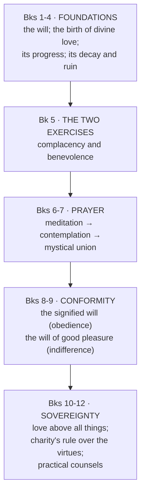

# 06 — *Treatise on the Love of God* (1616)

> [!abstract] Thesis
> Where the *Introduction* is the method, the *Treatise* is the **theology**: a complete account of charity from its first natural spark to the death of the will in God — written for **Theotimus**, the soul already advanced.

---

## 1. The movement of the twelve books

## 2. The starting point: God, and the heart made for God

God is the sovereign good; humanity is created in his image for grace and glory. Therefore:

> [!important] The natural inclination
> **God has planted in the human heart a natural inclination to love him above all things.** Original sin wounded but did not destroy it: it remains *"like a spark hidden among ashes"* — the **handle** by which preventing grace takes hold of us.

But: *"we do not naturally have the power to execute this supreme love without supernatural grace."*

> [!example] The eagle
> Eagles have *"far more sight than flight"*: the intellect sees God's goodness clearly; the wounded will lacks the strength to fly to him unaided.

Grace does not overpower liberty. It **"entices the heart"** — a "holy violence" that leaves the will free to consent or resist.

## 3. Cordial anthropology: heart and will

- The **heart** is the spiritual centre of the person.
- The **will** is a *"natural monarchy"* governing the other faculties: it commands exterior movements like slaves, but must manage the sensual appetite and the passions **like horses or hawks** — by skill and gentleness, not by decree.
- **Love is the first and principal affection of the will**, the root from which hope, fear, desire and grief derive.
- The will becomes what it loves: *"if the love is carnal, the will becomes carnal; if divine, spiritual."*

> [!tip] Why "cordial" matters
> Salesian theology is not anti-intellectual, but it locates the person in the **heart-as-will**, not the intellect. That is why feelings are secondary (they belong to the sensual appetite) and why aridity is no obstacle: **the will can love while the emotions are silent**.

## 4. The two exercises of holy love (Bk 5)

| | **Complacency** | **Benevolence** |
|---|---|---|
| Direction | God's perfections **into** the soul | The soul's heart **cast into** God |
| Act | Delight, spiritual *"drinking and eating"* of the divine goodness | Desiring God all honour and glory |
| Problem it faces | — | God's goodness is infinite; we cannot add to it |
| Resolution | — | So benevolence becomes **perpetual praise** and the summoning of all creation to magnify him |

## 5. The two wills of God (Bks 8–9) — the doctrinal core

| | **Signified will** | **Will of good pleasure** |
|---|---|---|
| How known | Commandments, evangelical counsels, holy inspirations | Events, circumstances, tribulations |
| Our response | **Active conformity and obedience** | **Passive submission, resignation, holy indifference** |
| Interior quality | The loving heart does not merely endure the commandments but finds them **sweet**, because they please the Beloved | Receives whatever comes, because it comes from him |

## 6. Resignation vs holy indifference

> [!warning] Do not confuse these in an exam
> **Resignation** submits — but with effort and a lingering self-interest. One accepts death patiently, yet would genuinely still prefer to live.
> **Holy indifference** *"loves nothing except for the love of God's will."* There is no residual preference left to overcome.

> [!quote] The ball of wax
> *"The indifferent heart is like a ball of wax in the hands of its God, receiving with equal readiness all the impressions of the eternal good pleasure; it is a heart without choice, equally disposed for everything, having no other object of its will than the will of its God, and placing its affection not upon the things that God wills, but upon the will of God who wills them."*

The extreme formulation: the indifferent soul would prefer hell to heaven **if God's good pleasure were more present there**. (Rhetorical limit-case, in the tradition of the *impossible supposition* — it measures the purity of the motive, and is the exact inversion of his own 1586 terror of reprobation → [[02 Life and Biography - Chronology]].)

## 7. Prayer: meditation → contemplation → quiet

Mystical theology *is* prayer: a *"silent conversing"* between the soul and God, **heart speaking to heart**.

> [!example] The bees
> Gathering nectar flower to flower = the active work of **meditation**. Relishing the gathered honey = the restful **contemplation**. (Bees wounding and being wounded also image the soul pierced by Christ's wounds of love.)

**Prayer of quiet:** the faculties gather inward around the presence of the Beloved; reasoning ceases; the soul is *"willing to be in prayer without any other aim than to be in the sight of God according as it shall please him."*

> [!example] The child at the breast
> The infant clinging to its mother's neck and drawing milk does not ask where the mother is walking. The soul draws nourishment and leaves all direction to God.

## 8. The death of the will

Not annihilation: *"it is so lost and dispersed in the will of God that it appears not, and has no other will than the will of God."* Image: **the traveller on a ship**, making no movement of his own, carried entirely by the vessel.

## 9. Ecstasy of act and life — the Salesian correction of mysticism

> [!important] The decisive move
> True ecstasy is **not** suspension of the senses or emotional rapture. The supreme proof of love is the **ecstasy of act and life**: living supernaturally, elevated above natural instinct, so wholly governed by charity that one can say with St Paul, *"I live, now not I, but Christ liveth in me."*

This is what keeps Salesian mysticism from becoming elitist. **The mystical summit is a way of living, not a state of consciousness** — therefore available, in principle, to Philothea in the marketplace.

## 10. The images — memorise these five

| Image | Teaches |
|---|---|
| **The deaf lutenist** (Martin) | A master player, gone deaf, keeps playing perfectly to please his prince though he hears nothing → serving God in total dryness, purely for his will |
| **The statue in the niche** | Stands exactly where the prince placed it, content → holy indifference resting in providence |
| **The child at the breast** | Draws milk, leaves the walking to the mother → prayer of quiet |
| **The bees** | Nectar-gathering vs honey-relishing → meditation vs contemplation |
| **The eagle** | More sight than flight → intellect sees, wounded will cannot fly without grace |

## 11. Calvary: the academy of love

Mount Calvary is *"the academy of love."*

> [!quote]
> *"Love and death are so mingled in the Passion of Our Saviour that we cannot have the one in our heart without the other."*
> *"During this mortal life we must choose eternal love or eternal death; there is no middle choice."*

And the summit, closing the whole work:

> [!quote] Vive Jésus
> *"To love, or to die! To die and to love! To die to all other love in order to live to Jesus' love, that we may not die eternally, but that living in Thy eternal love, O Saviour of our souls, we may eternally sing, Vive Jésus, Live Jesus. I love Jesus. Live Jesus, Whom I love! I love Jesus, Who lives and reigns for ever and ever. Amen."*

---

## Recall

- Q:: For whom is the *Treatise* written? A:: "Theotimus" — the soul already advanced in love
- Q:: What survives of the natural inclination to love God after the Fall? A:: It remains, weakened — "a spark hidden among ashes", the handle for preventing grace
- Q:: Distinguish complacency and benevolence. A:: Complacency draws God's perfections into the soul in delight; benevolence casts the heart into God, desiring him all glory — expressed as perpetual praise
- Q:: Distinguish the signified will and the will of good pleasure. A:: Signified = commandments/counsels/inspirations, met by active obedience; good pleasure = events and providence, met by submission and indifference
- Q:: Distinguish resignation and holy indifference. A:: Resignation submits with effort and a residual preference; indifference has no preference but God's will
- Q:: What is the ball of wax? A:: Image of the indifferent heart, taking every impression of the divine good pleasure equally
- Q:: What is the "ecstasy of act and life"? A:: Living so wholly governed by charity that Christ lives in one — superior to ecstasy of prayer or the senses
- Q:: What does the deaf lutenist teach? A:: Serving God faithfully in dryness, purely for his pleasure, without consolation
- Q:: What is Mount Calvary called? A:: "The academy of love"

Prev → [[05a Sacramental and Devotional Life]] | Next → [[07 Salesian Themes - Devout Humanism]]
