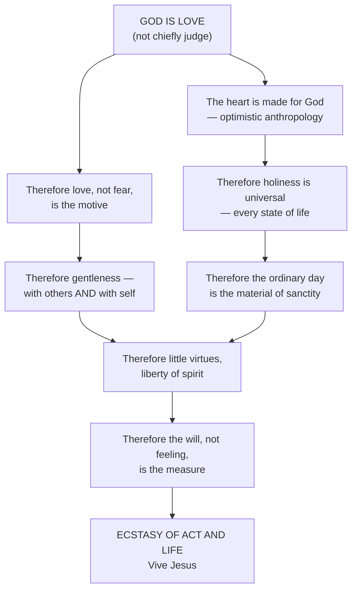

# 07 — Salesian Themes: Devout Humanism

> [!abstract] The synthesis note
> Eight master themes. Each one is stated, grounded in a text, and given its practical edge. Together they are what "the lens of St Francis de Sales" actually means: **a way of seeing God, the human person, and the ordinary day, all at once.**

---

## Theme 1 — The universal call to holiness

**Claim.** Devotion belongs to every state of life, and refusing this is not merely a mistake but a **heresy**.

> [!quote]
> *"God commands all Christians… to bring forth the fruits of devotion, each according to his talents and vocation."*
> *"It is an error, nay rather a heresy, to wish to banish the devout life from the army, from the workshop, from the courts of princes, from the households of married folk."*

**Edge.** The question is never *"should I leave my state of life to become holy?"* but *"what does holiness look like in this state?"* Devotion *"never spoils anything, but rather perfects all things"* — the bee taking honey without injuring the flower.

**Downstream.** This is the seed of modern lay spirituality and of the theology of the laity — and the same doctrine that **Vatican II** promulgates in *Lumen Gentium* ch. V (nn. 39–42), 355 years later → [[10 Legacy and the Salesian Family]].

---

## Theme 2 — Optimistic (cordial) anthropology

**Claim.** The human person is not chiefly a ruin to be feared but a **capacity for God**.

> [!quote] The ladder of perfections
> *"Man is the perfection of the universe; the spirit is the perfection of man; love, that of the spirit; and charity, that of love."*

> [!quote] The instinct for God
> *"Our heart, by a deep and secret instinct, in all its actions tends towards, and aims at, felicity."*
> *"As soon as man thinks with even a little attention of the divinity, he feels a certain delightful emotion of the heart, which testifies that God is God of the human heart."*

**Edge.** Grace has an ally inside the person. Evangelisation is therefore **awakening**, not conquest — you are appealing to something already there.

**Contrast to hold in mind:** against the rigorist and Jansenist temper that will dominate the next French century, and against a Calvinism of total depravity. Salesian optimism is not naïveté about sin — he is emphatic on self-love — but a refusal to make sin the deepest truth about the person.

---

## Theme 3 — The primacy of love over fear

> [!quote]
> *"It is better to fear God from love than to love Him from fear."*
> *"To love Him from fear… is to put gall into our food and to quench our thirst with vinegar; but to fear Him from love is to sweeten aloes and wormwood."*
> *"All is love's, and in love, for love, and of love."*

**Edge.** Motive is everything. The same act — fasting, obedience, correction — is a different act depending on whether love or fear generates it.

**Biographical root:** the 1586–87 terror of damnation, resolved by an act of love → [[02 Life and Biography - Chronology]].

---

## Theme 4 — Gentleness (*douceur*), including toward oneself

**Toward others.** *"Always be as gentle as you can, and remember that more flies are caught with a spoonful of honey than with a hundred barrels of vinegar. If we must err in one direction or the other, let it be in that of gentleness. No sauce was ever spoilt by too much sugar. The human mind is so constituted that it rebels against harshness, but becomes perfectly tractable under gentle treatment."*

**Not a temperament.** Camus records that the two passions costing him most to conquer were *"love of creatures and anger"*, and that he mastered his choleric nature *"by violence, or as he himself was wont to say, 'by taking hold of his heart with both hands.'"*

> [!important] Gentleness is an ascetical achievement, not a disposition
> This is the single most misunderstood point about him. The "gentle saint" is a **converted angry man**. Salesian gentleness is what severity looks like when it is turned inward on one's own self-love instead of outward on the neighbour.

**Toward oneself.**

> [!quote]
> *"Have patience with every one, but especially with yourself."*
> *"When we have committed a fault, let us at once examine our heart… We must then correct ourselves gently and quietly, and not irritate and disturb ourselves still more. Rise up, my heart, my friend… we must be charitable to our own soul, and not rebuke it over harshly."*

**Why.** Because violent self-reproach is itself a form of wounded pride. Hence his diagnosis of **scruples** as *"a cunning self-esteem… so subtle and crafty as to deceive even those who are troubled by it"* — the scrupulous cling to their own anxious opinion rather than submit to their director.

---

## Theme 5 — Liberty of spirit, and the little virtues

> [!quote] The governing principle of direction
> *"All by love, nothing by constraint."*
> *"In the royal galley of divine love there is no galley-slave; all the oarsmen are volunteers."*

**Against spiritual heroics.**
- *"It is far better to mortify the body through the spirit than the spirit through the body."*
- People want the dazzling virtues at the summit of the Cross, *"but very few are anxious to gather those which, like wild thyme, grow at the foot of that Tree of Life"* — yet these *"give out the sweetest perfume."*
- Perfection concretely: *"Kindly concessions to the exacting temper of our neighbour, gentle tolerance of his imperfections… patience with importunity."*

**The formula of detachment:** *"Ask for nothing, refuse nothing, imitate Jesus in His cradle."*

---

## Theme 6 — The will over feelings

> [!quote]
> *"The will governs all the other faculties of man's soul, yet it is governed by its love which makes it such as its love is."*
> Our *"superior will, which is our compass, must ever be fixed upon the love of God"* — whatever the emotions do.

**Edge.** Devotion is not measured by sensible fervour. Dry service is worth **more**: the rose gives a stronger scent when dried → [[05 Introduction to the Devout Life]] §9. This is the anti-illusion device of the whole system, and the pastoral rescue of every person who thinks they have lost their faith because they have lost their feelings.

---

## Theme 7 — The present moment and the ordinary duty

> [!quote]
> *"To do little actions with a great purity of intention and with a strong will to please God, is to do them excellently."*
> *"We turn little actions into great ones when we perform them with a supreme desire to please God."*
> *"We must make haste leisurely… He that is hasty with his feet, is in danger of stumbling."*
> *"Sufficient to the day is the labour thereof."*

**Edge.** Anxiety and over-eagerness are treated as **spiritual faults**, not as zeal. The Salesian remedy for an overloaded life is not more effort but a smaller unit of time: this action, now, for God.

---

## Theme 8 — The heart, and "Live Jesus"

Everything above converges on the *cor ad cor* principle: God deals with the heart, the preacher speaks heart to heart, the soul prays heart to heart, and the goal is the substitution of hearts — *"I live, now not I, but Christ liveth in me."* The motto **Vive Jésus** is not a pious slogan but the shorthand of the whole doctrine → [[06 Treatise on the Love of God]] §11.

---

## The themes as a single system

> [!tip] One sentence for the exam
> **Salesian devout humanism = an optimistic anthropology plus a love-primacy theology, cashed out as gentleness, little virtues, and the sanctification of the present duty — with holy indifference as its mystical term.**

---

## Recall

- Q:: What does he call the wish to banish devotion from ordinary states of life? A:: "An error, nay rather a heresy"
- Q:: Give his ladder of perfections. A:: "Man is the perfection of the universe; the spirit is the perfection of man; love, that of the spirit; and charity, that of love"
- Q:: Complete: "It is better to fear God from love than…" A:: "…to love Him from fear"
- Q:: Which two passions did he say cost him most to conquer? A:: Love of creatures, and anger
- Q:: How did he describe conquering his temper? A:: "By taking hold of his heart with both hands"
- Q:: Quote his image against spiritual coercion. A:: "In the royal galley of divine love there is no galley-slave; all the oarsmen are volunteers"
- Q:: His three-part rule of detachment? A:: "Ask for nothing, refuse nothing, imitate Jesus in His cradle"
- Q:: What does he diagnose as the root of scruples? A:: A cunning self-esteem

Prev → [[06 Treatise on the Love of God]] | Next → [[07a The Virtues and the Spiritual Combat]]
